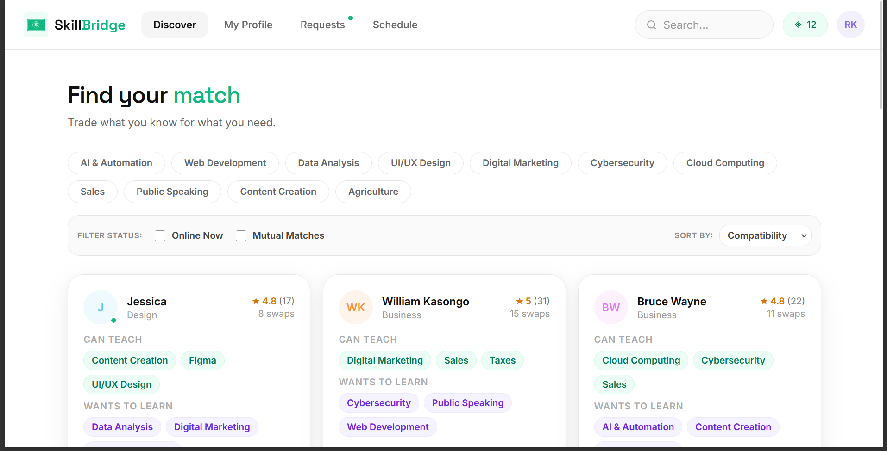

# SkillBridge

A full-stack **React + Node.js** platform that connects students to share skills, book learning sessions, and manage skill-exchange requests. SkillBridge also plays a role in a three-team API ring: it **provides** an expert-directory API to **Farmers-AgroConnect** and **consumes** vendor/logistics data from **Maji Website**.

Built as a semester project using **React**, **Express**, and **SQLite**.

---

## Preview

### Home Page



## Features

### Accounts & Access

* Sign up with a username, phone number, and password.
* Log in as a regular user or an admin.
* Every account (including admin) starts on a shared default password and is required to set a real one on first login.
* Change your own password any time from your profile.
* Admins can register, edit, or delete any account, and reset a user's password directly.
* Every admin action is written to an audit log (who did what, to whom, when).

### Expert Discovery

* Browse verified expert profiles.
* Filter experts by **estate**.
* Sort by **rating** or **proximity**.
* View detailed expert profiles.

### Skills Marketplace

* Browse categorized skills, including a dedicated **Agriculture** category (Agronomy, Soil Health, Irrigation Systems, Farm Tech, and more).
* Filter skills by category tag.
* Add or remove skills you offer/want from your own profile.

### Consultation Booking

* View expert availability.
* Book consultation sessions.
* Submit learning requests (skill swaps or Skill Coin requests).
* Track request status.

### Reviews

* View expert ratings.
* Read review summaries.
* See completed session statistics.

### Logistics Integration (Maji Website)

* Discover nearby vendor water stations for in-person study sessions.
* Runs against mock data until Maji's real API is configured — every response is clearly labeled `"source": "mock"` or `"source": "live"`.

### Interface

* Light and dark mode, toggleable from the nav bar.
* Mobile-responsive navigation (collapses to a slide-down menu on small screens).
* Keyboard-navigable calendar and accessible labels throughout.

---

## Tech Stack

| Layer         | Technology                     |
| ------------- | ------------------------------- |
| Frontend      | React 18 + Vite                 |
| Backend       | Node.js + Express                |
| Database      | SQLite (better-sqlite3)          |
| Auth          | bcryptjs (password hashing) + opaque bearer tokens |
| Styling       | Tailwind CSS + CSS variables (theming) |
| API           | REST                             |
| Documentation | OpenAPI 3.0                      |

---

## Project Structure

```text
SkillBridge-webapp-main/
│
├── src/
│   ├── components/
│   ├── context/          # AuthContext (login/signup/session state)
│   ├── pages/             # incl. AuthScreen, AdminPage, ForcePasswordChangeScreen
│   ├── documentation/
│   ├── App.jsx
│   └── api.js
│
├── server/
│   ├── routes/            # incl. auth.routes.js, admin.routes.js
│   ├── middleware/         # requireAuth, requireAdmin
│   ├── services/           # majiClient.js (upstream integration)
│   ├── db.js
│   └── server.js
│
├── openapi.yaml
├── package.json
└── README.md
```

---

## Installation

### 1. Clone the repository

```bash
git clone https://github.com/muthokaricky-alt/SkillBridge-webapp.git
cd SkillBridge-webapp
```

### 2. Install dependencies

```bash
npm install
```

### 3. Configure environment variables (optional)

Copy the example file if you want to point the frontend at a different backend URL, or configure a real Maji Website API:

```bash
cp .env.example .env
```

No configuration is required for local development — the database and default accounts are created automatically.

### 4. Start the backend

```bash
npm run server
```

### 5. Start the frontend

Open another terminal:

```bash
npm run dev
```

The application will be available at:

* Frontend: `http://localhost:5173`
* Backend: `http://localhost:3001`

### 6. Log in

Every account starts on the same default password and must change it on first login.

| Account | Username | Default password |
| ------- | -------- | ----------------- |
| Admin   | `admin`  | `1234`             |
| Any seeded student (e.g. Bill Amani) | auto-generated from their name, e.g. `billamani` | `1234` |

Or sign up as a brand-new user from the login screen.

---

## API Overview

Full endpoint-by-endpoint detail lives in `src/documentation/DATABASE.md` and `openapi.yaml`; this is a quick map of what exists.

### Auth

| Method | Endpoint          | Description                        |
| ------ | ------------------ | ----------------------------------- |
| POST   | `/api/auth/signup`  | Create a new user account           |
| POST   | `/api/auth/login`   | Log in with username + password     |
| POST   | `/api/auth/logout`  | Invalidate the current session token |
| GET    | `/api/auth/me`      | Get the currently logged-in user    |
| PATCH  | `/api/auth/password`| Change your own password (needs old password) |

### Admin (requires an admin account)

| Method | Endpoint                        | Description                     |
| ------ | -------------------------------- | -------------------------------- |
| GET    | `/api/admin/users`               | List every account, full details |
| POST   | `/api/admin/users`                | Register a new account            |
| PATCH  | `/api/admin/users/:id`            | Edit any account                  |
| PATCH  | `/api/admin/users/:id/password`   | Reset a user's password directly  |
| DELETE | `/api/admin/users/:id`            | Delete an account                 |
| GET    | `/api/admin/audit-log`            | View every admin action taken     |

### Profile, Requests, Sessions (require login)

| Method | Endpoint                          | Description                    |
| ------ | ----------------------------------- | -------------------------------- |
| GET    | `/api/profile`                       | Your profile, skills, coins    |
| POST   | `/api/profile/skills`                | Add a skill you offer/want      |
| DELETE | `/api/profile/skills/:type/:value`   | Remove a skill                  |
| PATCH  | `/api/profile/coins`                 | Adjust Skill Coin balance        |
| GET    | `/api/requests`                       | List skill-exchange requests    |
| POST   | `/api/requests`                       | Create a request (or, for AgroConnect, a consultation booking) |
| GET    | `/api/sessions`                       | List booked sessions             |
| POST   | `/api/sessions`                       | Schedule a session                |

### Downstream — provided to Farmers-AgroConnect (no login required)

| Method | Endpoint                       | Description         |
| ------ | -------------------------------- | ---------------------- |
| GET    | `/api/experts`                    | List experts, filterable/sortable |
| GET    | `/api/experts/{id}`               | Expert details        |
| GET    | `/api/experts/{id}/availability`  | Open time slots        |
| GET    | `/api/experts/{id}/reviews`       | Aggregate rating/reviews |
| GET    | `/api/skills`                      | Categorized skill catalogue |

### Upstream — consumed from Maji Website (proxied through our backend)

| Method | Endpoint                    | Description               |
| ------ | ----------------------------- | --------------------------- |
| GET    | `/api/logistics/stations`      | Nearby vendor water stations |
| GET    | `/api/logistics/estates`       | Estates with active delivery |

See `src/documentation/CONTRACT_QUESTIONS.md` for what's genuinely different between our original assumptions and Maji's real API (notably: no delivery-tracking or per-estate payment-methods endpoints exist upstream).

---

## OpenAPI Documentation

This project includes an OpenAPI 3.0 specification covering the AgroConnect/Maji ring contract:

* `openapi.yaml`

To validate it, paste it into [Swagger Editor](https://editor.swagger.io) and confirm zero validation errors.

---

## Database

SkillBridge uses **SQLite** via `better-sqlite3` — a single local file (`skillbridge.db`), created and migrated automatically on first run. No separate database server needed. See `src/documentation/DATABASE.md` for the full schema.

Reset the database anytime with:

```bash
npm run db:reset
```

---

## Development Scripts

| Command              | Purpose                             |
| --------------------- | ------------------------------------- |
| `npm run dev`          | Start Vite (frontend)                |
| `npm run dev -- --host`| Start Vite, reachable from other devices on the network |
| `npm run build`        | Production build                     |
| `npm run preview`      | Preview build                        |
| `npm run server`       | Start Express server                 |
| `npm run server:dev`   | Start server with Nodemon             |
| `npm run db:reset`     | Reset SQLite database                 |

---

## Documentation

Additional documentation is located in `src/documentation/`, including:

* `API_NEEDS.md`, `API_NEEDS_DOWNSTREAM.md`, `API_NEEDS_UPSTREAM.md` — Week 2 needs statements
* `ENDPOINT_LIST.md` — Week 3 endpoint design + peer review
* `CONTRACT_QUESTIONS.md` — questions raised after reviewing Maji's real contract
* `DATABASE.md` — full schema reference
* `PART_B_AUDIT.md` — Week 1 resource/action audit
* `TEAM_CHARTER.md`, `CONTRIBUTORS.md` — team process docs

The first three and `PART_B_AUDIT.md`/`ENDPOINT_LIST.md` are dated weekly lab deliverables and are kept as historical snapshots rather than updated to match later changes.

---

## Future Improvements

* Real (non-mock) integration with Maji Website once their live API is available
* Per-user scoping for requests/sessions (currently a shared list across all logged-in accounts)
* Session token expiry
* Real-time chat / notifications
* Image uploads for profiles
* Deployment (Render/Vercel)
* Analytics dashboard

---

## Contributors

Developed as a collaborative university project.

See:

```text
src/documentation/CONTRIBUTORS.md
```

---

## License

This project is intended for educational purposes as part of a university software engineering project.
